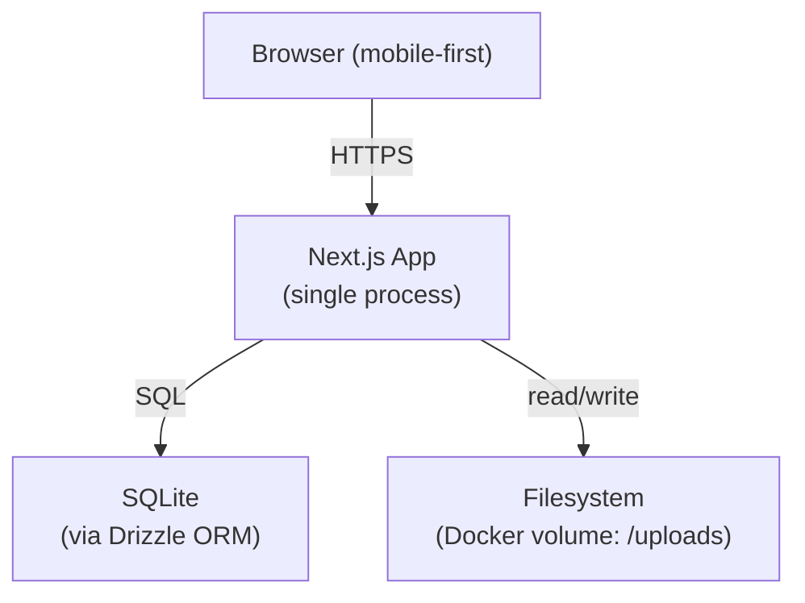
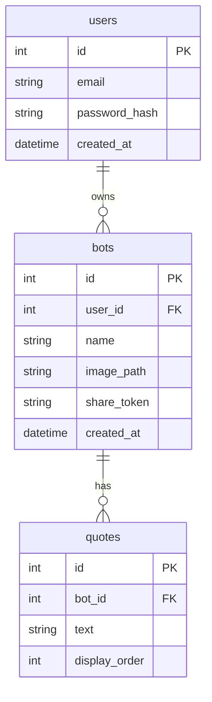

# High-Level Design: wulkebots

## Problem

Kids draw constantly, but those drawings live in notebooks or on fridge doors — seen by few people and soon forgotten. There is no easy way for a child to share a drawing with grandparents, friends, or extended family in a way that feels interactive and alive rather than just a photo in a chat thread.

Parents who want to share their kids' art face the same friction: taking a picture is easy, but making it feel special and shareable requires tools (video editing, animation apps) that are heavyweight and adult-oriented.

## Approach

wulkebots turns a photo of a child's drawing into a lightweight interactive character — a "wulkebot" — that lives at a unique URL. The parent does the setup work (photo upload, writing the bot's quotes); the kid and their audience get the fun part (tapping to hear the bot speak, nudging it around the screen).

The core mechanism is a shareable link with no viewer login requirement. Anyone with the link can open the bot and interact with it. This keeps sharing frictionless — text the link to grandma, she taps it on her phone, the bot bounces and talks.

## Target Users

**Creators (parents):** A parent with a child who draws. They want to celebrate the drawing and share it with family. They are comfortable creating an account and spending a few minutes setting up a bot, but they are not technical. They use the app on their phone.

**Viewers (family and friends):** Grandparents, cousins, friends — anyone who receives a share link. They have no account and will not create one. They interact with the bot on whatever device they have. The experience must be immediately legible with zero instructions.

**Kids:** Not direct users of the creator flow, but the audience for their own bot when a parent shows them their drawing "talking." The bot's interactivity is part of what makes the drawing feel special to the child.

## Goals

- A parent can go from photo to shareable link in under two minutes.
- A viewer can open a share link and interact with the bot within three seconds of page load (no login, no install, no tutorial).
- At least one family member reports the experience as "delightful" or "fun" during the first real-user test.
- The full MVP can be deployed by the developer to a fresh Linux VPS in under 30 minutes.

## Non-Goals

- **AI image transformation.** The drawing is displayed as a photo. No tracing, vectorizing, animating, or style-transferring the image in v1.
- **Public discovery.** There is no feed, explore page, or search. Bots are only accessible via their share link.
- **Kid-owned accounts.** Kids do not create accounts or manage bots. The parent is the sole account holder.
- **Social features.** No comments, reactions, or follower relationships in v1.
- **Native mobile app.** The experience is a mobile-first web app. No App Store or Play Store submission.
- **Abuse mitigation beyond basics.** Rate limiting and DDOS protection are deferred; they are a post-launch concern once there is something worth protecting.

## Tenets

- **Sharing over features.** When a decision makes sharing easier at the cost of a creator feature, prefer sharing. The viewer experience is the product; the creator experience is the means.
- **One process over many.** The entire application runs as a single Docker container. Complexity that requires a second service is deferred until there is a forcing function.
- **The drawing is the star.** The bot's visual presentation should never compete with the drawing itself. UI chrome is minimal; the drawing fills the space.

## System Design

All application logic runs inside a single Next.js process (standalone output mode). SQLite holds all relational data. Images are stored on the local filesystem in a mounted Docker volume.

### Pages and routes

| Route | Auth required | Description |
|---|---|---|
| `/` | No | Marketing/landing page with "Create a bot" CTA |
| `/register` | No (redirect if authed) | Parent account creation |
| `/login` | No (redirect if authed) | Parent login |
| `/dashboard` | Yes | Lists all parent's bots with share links |
| `/create` | Yes | Upload photo, add quotes, save bot |
| `/b/[token]` | No | Viewer page — the shareable bot experience |

### Data model

### Auth flow

Parent credentials (email + bcrypt-hashed password) are stored in SQLite. On login, a JWT is issued and stored in an `httpOnly` cookie. Middleware on creator routes (`/dashboard`, `/create`, `/api/bots/*`) verifies the JWT on every request. No refresh tokens in v1 — sessions expire after 30 days.

### Image storage

Uploaded images are written to `/uploads/{botId}/{filename}` on the container's filesystem. The Docker volume mounts this directory so images survive container restarts and redeployments. Next.js serves images via a route handler that reads from the filesystem — no CDN, no external storage.

### Viewer interaction

The viewer page is a client component. The drawing image is displayed filling the viewport. Two interaction primitives:

1. **Tap/click the bot** — cycles through the bot's quotes in a speech bubble overlay. On the last quote, wraps back to the first.
2. **Directional arrows** — four arrow buttons (↑ ↓ ← →) translate the bot's position on screen using CSS `transform: translate()`. No physics, no boundary enforcement in v1.

All interaction is local state in the browser — no server calls after the initial page load.

## Key Design Decisions

| Decision | Chosen | Alternatives considered | Rationale |
|---|---|---|---|
| Application architecture | Single Next.js app (one process, one container) | Separate frontend + API service | Eliminates ops overhead for a solo MVP. No forcing function for separation exists yet. |
| Database | SQLite via Drizzle ORM | PostgreSQL, MySQL | SQLite requires zero server setup, backs up as a file copy, and handles wulkebots' write volume trivially. Drizzle provides type-safe queries with minimal abstraction. |
| Image storage | Local filesystem (Docker volume) | S3-compatible object storage | No external service dependency; migrating to object storage later is a well-understood lift. For MVP scale, a filesystem is sufficient. |
| Auth | Custom JWT + bcrypt | Clerk, Auth.js, Supabase Auth | No vendor dependency; full control over session shape. The implementation is small enough that a custom solution is not a liability. |
| Viewer interaction | Client-side state only | Server-sent events, WebSockets | The viewer page needs no real-time data after load. Keeping interaction local eliminates server load entirely and makes the page fast on slow connections. |
| Share mechanism | Unique opaque token per bot | Sequential IDs, slugs | Opaque tokens (UUID or similar) prevent enumeration. Sequential IDs would let anyone discover bots by incrementing the URL. |

## Success Metrics

- **Time to share**: median time from account creation to first copied share link is under 3 minutes (measured by developer self-test).
- **Viewer load time**: the `/b/[token]` page reaches interactive on a mid-range Android on a 4G connection in under 3 seconds.
- **Zero-instruction legibility**: a viewer unfamiliar with the app taps the bot within 10 seconds of opening the link without being told to.
- **Deploy repeatability**: the developer can deploy to a fresh VPS from scratch in under 30 minutes using only `CLAUDE.md` and the repo.

## References

- GitHub repo: https://github.com/wulke/wulkebots
- MVP milestone: https://github.com/wulke/wulkebots/milestone/1
- LID methodology: https://github.com/jszmajda/lid
